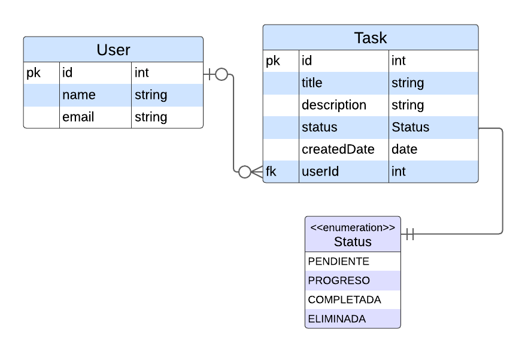

# Descripción

Rest API para gestionar tareas de usuarios.

## Consigna

Contexto: Imagine que está construyendo una aplicación de gestión de tareas.  
Necesita crear una API REST para gestionar las tareas de los usuarios.  
Cada tarea tiene un título, una descripción y un estado (pendiente, en progreso, completada, eliminada).  
Requisitos:

- Crear una nueva tarea.
- Leer una lista de todas las tareas.
- Leer una tarea específica por su ID.
- Actualizar una tarea existente (título y descripción).
- Borrar de manera lógica una tarea por su ID.
- Implementa una ruta adicional para filtrar tareas por estado. Por ejemplo, /tareas/pendientes debería devolver todas las tareas pendientes.
- Implementa servicios que permitan cambiar de estado una tarea en particular.
- Implementa una lógica de negocio adicional que calcule el tiempo transcurrido desde la creación de una tarea en días. Puedes agregar una nueva ruta, por ejemplo, /tareas/:id/dias-transcurridos, que devuelva el número de días transcurridos desde la creación de la tarea con el ID proporcionado.
- Utiliza una base de datos de tu elección (por ejemplo, MongoDB, MYSQL, etc.) para almacenar las tareas.
- Desarrolle los tests unitarios sobre cada caso de uso.

## Techs

- Nest.js
- TypeORM
- PostgreSQL
- Local db con Docker para correr en modo desarrollo y e2e tests

## Entity Relationship Diagram



## API Endpoints:

| HTTP Method | Endpoint                | Description                                        |
| ----------- | ----------------------- | -------------------------------------------------- |
|             | **Tasks**               |                                                    |
| POST        | /tasks                  | Create a new task                                  |
| GET         | /tasks                  | Get all tasks                                      |
| GET         | /tasks/:id              | Get a task by ID                                   |
| PATCH       | /tasks/:id              | Update a task by ID                                |
| DELETE      | /tasks/:id              | Delete a task by ID                                |
| PATCH       | /tasks/:id/status       | Update the status of a task                        |
| GET         | /tasks/status/:status   | Get tasks by status                                |
| GET         | /tasks/:id/days-elapsed | Get the number of days elapsed since task creation |
|             | **Users**               |                                                    |
| POST        | /users                  | Create a new user                                  |
| GET         | /users                  | Get all users                                      |
| GET         | /users/:id              | Get a user by ID                                   |
| PATCH       | /users/:id              | Update a user by ID                                |
| DELETE      | /users/:id              | Delete a user by ID                                |

## Correr localmente

**⚠️ IMPORTANTE:** Necesitas tener Docker instalado para ejecutar una base de datos Postgres localmente.

### Clonar el repo e instalar dependencias

```bash
git clone https://github.com/nico-bt/tasks-api.git
npm install
```

### Configuración archivo .env

Para configurar las variables de entorno, crea un archivo `.env` en el directorio raíz con el siguiente contenido:

```plaintext
DATABASE_USER=postgres
DATABASE_PASSWORD=postgres
DATABASE_NAME=postgres
DATABASE_PORT=5432
DATABASE_HOST=localhost
```

### Iniciar base de datos local con Docker

```bash
docker compose up -d
```

Este comando levantará dos bases de datos locales.  
Una para desarrollo (port 5432) y otra para correr los test e2e (port 5435)

### Correr la app en modo desarrollo

```bash
npm run start:dev
```

### Para cerrar la base de datos en Docker al terminar

```bash
docker compose down
```

## Tests

### Unit tests

```bash
npm run test
```

### e2e Tests

**⚠️ IMPORTANTE:** Los tests de integración usan una base de datos exclusiva a parte.  
Por esto, para que funcionen tenés que tener corriendo el container de docker creado con:
docker compose up -d

```bash
npm run test:e2e
```
